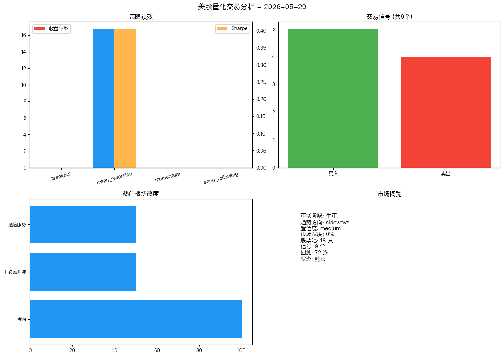
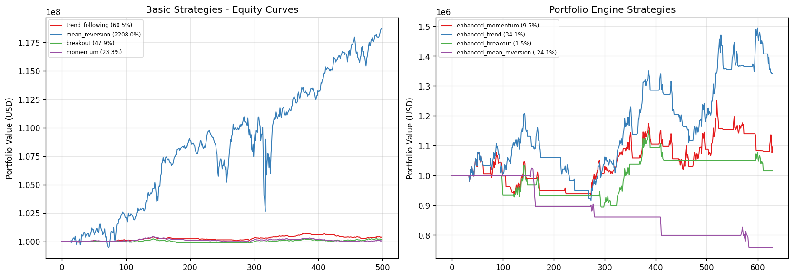

# 美股量化交易系统 (US)

基于 **多智能体架构** 的美股每日动态机会点挖掘系统。

---

## 今日分析 (2026-05-29)

### 📊 策略绩效

| 策略 | 收益率 | Sharpe | 最大回撤 |
|------|--------|--------|---------|
| breakout | 0.00% | 0.000 | 0.00% |
| mean_reversion | **+16.78%** | **0.406** 🏆 | -22.72% |
| momentum | 0.00% | 0.000 | 0.00% |
| trend_following | 0.00% | 0.000 | 0.00% |

### 📊 市场研判

| 维度 | 判断 |
|------|------|
| 市场阶段 | 牛市 |
| 趋势方向 | sideways |
| RSI | 67.8 |
| 波动率(年化) | 980.0% |

**标普500**: 7575 点 | **市场宽度**: 0% 股票站上MA50

### ⚠️ 风险控制

| 指标 | 值 |
|------|-----|
| 当前回撤 | 0.00% |
| 状态 | normal |

### 📈 可视化



---

## 系统架构

```
新闻 ──→ 板块 ──→ 日线数据 ──→ 技术指标 ──→ 时间序列信号 ──→ RL决策 ──→ 报告/可视化/飞书
```

10 Agent 管线: HotSector → DataFetch → TSSignal → RL → MultiStrategy → Risk → Report → Viz → Feishu → Storage

## 快速开始

```bash
git clone https://github.com/luojiahuli/rl_trading_us.git
cd rl_trading_us
pip install -r requirements.txt  # 或 pip3
python main.py
```

### Web UI

```bash
python app.py --port 7862
# 浏览器打开 http://localhost:7862
```

### 每日推送

```bash
bash daily_push.sh
```

## 配置

| 变量 | 说明 | 默认值 |
|------|------|--------|
| `FEISHU_APP_ID` | 飞书应用 ID | 环境变量 `FEISHU_APP_ID` |
| `FEISHU_APP_SECRET` | 飞书应用 Secret | 环境变量 `FEISHU_APP_SECRET` |
| `FEISHU_CHAT_ID` | 飞书群 ID | 环境变量 `FEISHU_CHAT_ID` |
| `MIN_STOCK_PRICE` | 最低股价过滤 | $5.0 |
| `INITIAL_CASH` | 初始资金 | $1,000,000 |


## 回测表现
更新日期: 2026-05-30
初始资金: $1,000,000
数据范围: 2024-01-01 ~ 2026-05-30

### 基础策略 (逐只回测合计)
| 策略 | 总收益率 | Sharpe | 最大回撤 | 交易次数 |
|------|---------|--------|---------|---------|
| mean_reversion | +2207.97% | 0.54 | -21.37% | 2441 |
| trend_following | +60.50% | 0.01 | -0.37% | 36 |
| breakout | +47.90% | 0.01 | -0.41% | 9 |
| momentum | +23.34% | 0.01 | -0.65% | 37 |

### 组合引擎 (集中投资+止损止盈)
| 策略 | 总收益率 | Sharpe | 最大回撤 | 交易次数 | 止损次数 | 止盈次数 |
|------|---------|--------|---------|---------|---------|---------|
| enhanced_trend | +34.10% | 0.69 | -24.16% | 52 | 5 | 6 |
| enhanced_momentum | +9.52% | 0.29 | -13.99% | 29 | 6 | 1 |
| enhanced_breakout | +1.47% | 0.11 | -13.57% | 9 | 1 | 1 |
| enhanced_mean_reversion | -24.11% | -1.49 | -25.94% | 5 | 5 | 0 |



详细数据: [/Users/mac13/workspace/rl_trading_us/output/reports/equity_curves_20260530.csv](/Users/mac13/workspace/rl_trading_us/output/reports/equity_curves_20260530.csv)
